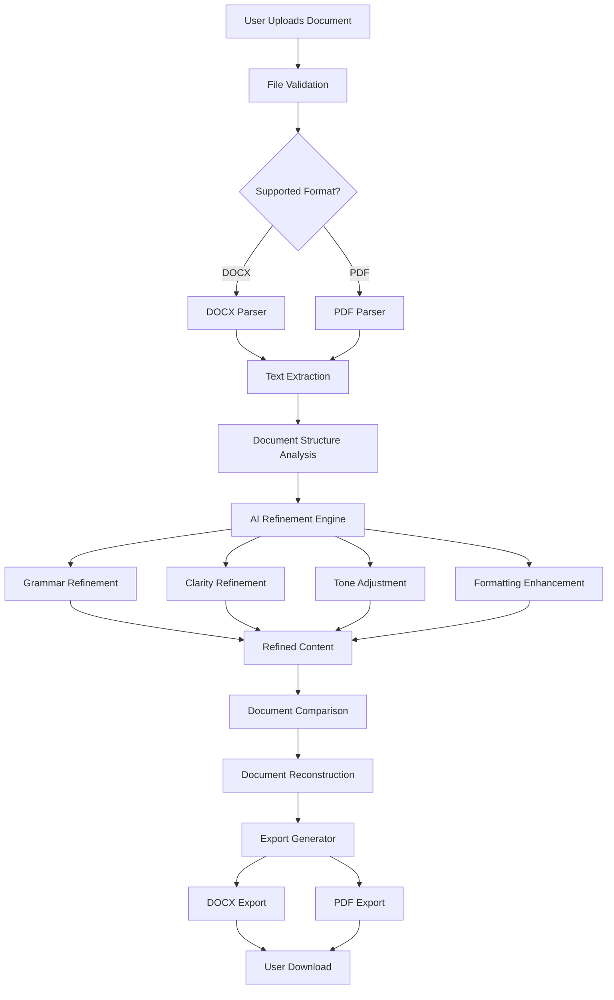

<div align="center">


# ScholarFix

### AI-Powered Document Refinement Platform

**Refine. Don't Rewrite.**

An AI-powered platform that helps students, professionals, researchers, and job seekers improve the clarity, grammar, tone, and structure of their documents while preserving their original meaning and voice.

<br />

<a href="https://github.com/Ayman-muhammad/scholarfix">
  
</a>


<br />
<br />

<a href="#-overview">Overview</a>
• <a href="#-features">Features</a>
• <a href="#-how-it-works">How It Works</a>
• <a href="#-architecture">Architecture</a>
• <a href="#-technology-stack">Technology</a>
• <a href="#-installation">Installation</a>
• <a href="#-roadmap">Roadmap</a>
• <a href="#-contributing">Contributing</a>

</div>

---

## 📸 Platform Preview

<p align="center">
  
</p>

<p align="center">
  
</p>

---

## 🌍 Overview

ScholarFix is an **AI-powered document refinement platform** built to improve existing writing without replacing the author's work.

Unlike traditional AI writing tools that generate entire essays, reports, or documents from scratch, ScholarFix follows a **refinement-first approach**.

> **You write. ScholarFix helps you refine.**

The platform analyzes existing documents and improves areas such as:

* Grammar
* Spelling
* Sentence clarity
* Readability
* Professional tone
* Academic tone
* Document formatting
* Citation consistency

The goal is not to replace the author.

The goal is to make the author's existing work clearer, stronger, and more professional.

```text
Original Writing
       +
AI-Assisted Refinement
       =
Clearer, Stronger Document
```

---

## 🎯 The Problem

AI has made writing assistance more accessible than ever.

However, many AI writing platforms introduce serious challenges.

### Common Problems

* Entire assignments can be rewritten by AI.
* The author's original writing style can disappear.
* Generated content may introduce academic integrity concerns.
* Users may not understand what AI changed.
* AI-generated content can introduce unsupported claims.
* The original structure and meaning of a document may be altered.

ScholarFix addresses these challenges by focusing on **controlled refinement rather than unrestricted content generation**.

The author remains at the center of the writing process.

---

## 💡 The ScholarFix Philosophy

ScholarFix follows one simple principle:

> **Improve the expression. Preserve the meaning.**

The system is designed to enhance the quality of writing while maintaining:

* Author ownership
* Original intent
* Document context
* Writing style
* Logical structure
* Human control

```text
                    USER
                      │
                      ▼
              WRITES DOCUMENT
                      │
                      ▼
              ┌──────────────┐
              │  SCHOLARFIX  │
              │ AI REFINEMENT│
              └──────┬───────┘
                     │
        ┌────────────┼────────────┐
        ▼            ▼            ▼
    Grammar       Clarity        Tone
        │            │            │
        └────────────┼────────────┘
                     ▼
              USER REVIEWS
                     │
                     ▼
              FINAL DOCUMENT
```

---

# ✨ Features

## 🧠 AI-Powered Document Refinement

ScholarFix analyzes existing writing and applies targeted improvements.

### Refinement Capabilities

* Grammar correction
* Spelling correction
* Sentence clarity improvement
* Readability enhancement
* Professional tone adjustment
* Academic writing refinement
* Formatting suggestions
* Citation formatting support

The AI is designed to work with the existing content instead of replacing it with unrelated or entirely new writing.

---

## 📄 Multi-Format Document Support

ScholarFix supports common document formats used by students and professionals.

| Format   | Upload | Processing | Export |
| -------- | :----: | :--------: | :----: |
| DOCX     |    ✅   |      ✅     |    ✅   |
| PDF      |    ✅   |      ✅     |    ✅   |
| TXT      |   🔜   |     🔜     |   🔜   |
| Markdown |   🔜   |     🔜     |   🔜   |
| LaTeX    |   🔜   |     🔜     |   🔜   |

The platform extracts document content and processes it while aiming to preserve its logical structure.

---

## ⚙️ Configurable Refinement Options

Users can choose how their document should be refined.

```text
┌──────────────────────────────────────┐
│         REFINEMENT OPTIONS           │
├──────────────────────────────────────┤
│  ✓ Grammar & Spelling                │
│  ✓ Clarity Improvement               │
│  ✓ Tone Adjustment                   │
│  ✓ Formatting Enhancement            │
│  ✓ Citation Formatting               │
└──────────────────────────────────────┘
```

This gives users more control over the refinement process.

Instead of applying every possible modification, ScholarFix can focus on the specific improvements selected by the user.

---

## 🔍 Document Comparison

ScholarFix allows users to compare their original content with the refined version.

```text
┌──────────────────────────┬──────────────────────────┐
│     ORIGINAL DOCUMENT    │     REFINED DOCUMENT     │
├──────────────────────────┼──────────────────────────┤
│                          │                          │
│   User-written content  │   AI-refined content     │
│                          │                          │
└──────────────────────────┴──────────────────────────┘
```

This helps users:

* Understand what changed
* Review AI suggestions
* Maintain transparency
* Preserve authorship
* Keep control of the final document

---

## 🛡️ Ethical AI Design

ScholarFix is built around responsible AI-assisted writing.

The system is designed to support the author rather than replace the author.

### ScholarFix Promotes

* Academic integrity
* Transparency
* Author ownership
* Responsible AI usage
* Preservation of writing voice
* Human review

### ScholarFix Avoids

* Generating entire assignments without user content
* Inventing research
* Adding unsupported claims
* Replacing the author's argument
* Removing meaningful context
* Treating AI output as unquestionable

```text
Human Authorship
       │
       ▼
Original User Content
       │
       ▼
AI-Assisted Refinement
       │
       ▼
Transparent Comparison
       │
       ▼
Human Review
       │
       ▼
Final Document
```

---

## 📤 Multi-Format Export

Refined documents can be exported in supported formats.

### Available

* DOCX
* PDF

### Planned

* Markdown
* TXT
* HTML
* LaTeX

---

# 🔄 How It Works

ScholarFix follows a structured document processing workflow.

```text
Document Upload
      │
      ▼
File Validation
      │
      ▼
Document Parsing
      │
      ├───────────────┐
      ▼               ▼
    DOCX             PDF
      │               │
      └───────┬───────┘
              ▼
       Text Extraction
              │
              ▼
    Document Structure Analysis
              │
              ▼
       AI Refinement Engine
              │
      ┌───────┼────────┐
      ▼       ▼        ▼
   Grammar  Clarity   Tone
      │       │        │
      └───────┼────────┘
              ▼
      Refined Content
              │
              ▼
      Document Comparison
              │
              ▼
    Document Reconstruction
              │
              ▼
       Export Generator
              │
       ┌──────┴──────┐
       ▼             ▼
      DOCX          PDF
       │             │
       └──────┬──────┘
              ▼
      Refined Download
```

---

# 🏗 Architecture

ScholarFix is designed around a modular document processing architecture.



---

# 🧩 Core System Components

```text
ScholarFix
│
├── Document Ingestion
│   ├── File Upload
│   ├── File Validation
│   └── Security Checks
│
├── Document Processing
│   ├── DOCX Parser
│   ├── PDF Parser
│   └── Text Extraction
│
├── AI Refinement Layer
│   ├── Grammar Engine
│   ├── Clarity Engine
│   ├── Tone Engine
│   └── Formatting Engine
│
├── Comparison Layer
│   ├── Original Content
│   ├── Refined Content
│   └── Change Detection
│
├── Export Layer
│   ├── DOCX Generator
│   └── PDF Generator
│
└── User Interface
    ├── Upload
    ├── Configuration
    ├── Processing
    ├── Comparison
    └── Download
```

---

# 🧱 Technology Stack

## Frontend

* HTML5
* CSS3
* JavaScript
* Bootstrap

## Backend

ScholarFix is designed to support a modular backend architecture using technologies such as:

* Node.js
* Express.js
* PHP

The backend should remain independent from the presentation layer.

---

## AI Integration

AI services are accessed through an abstraction layer.

```text
Application
      │
      ▼
AI Service Layer
      │
      ├── Language Model Provider
      │
      ├── Alternative AI Providers
      │
      └── Future Local Models
```

This architecture helps prevent the application from becoming tightly coupled to a single AI provider.

---

## Document Processing

The document processing layer can include:

* DOCX parsing libraries
* PDF text extraction tools
* Document structure analysis
* Document reconstruction services
* Export generation utilities

---

## Infrastructure

* Linux hosting environment
* Git
* GitHub
* Environment variables
* API-based architecture

---

# 📁 Project Structure

A scalable structure for ScholarFix may look like this:

```text
scholarfix/
│
├── client/
│   ├── assets/
│   │   ├── images/
│   │   └── icons/
│   │
│   ├── css/
│   │
│   ├── js/
│   │
│   ├── pages/
│   │
│   └── index.html
│
├── server/
│   │
│   ├── config/
│   │
│   ├── controllers/
│   │   └── documentController.js
│   │
│   ├── services/
│   │   ├── aiService.js
│   │   ├── documentService.js
│   │   └── exportService.js
│   │
│   ├── parsers/
│   │   ├── pdfParser.js
│   │   └── docxParser.js
│   │
│   ├── middleware/
│   │   ├── validation.js
│   │   └── errorHandler.js
│   │
│   ├── routes/
│   │   └── documentRoutes.js
│   │
│   ├── uploads/
│   │
│   └── server.js
│
├── docs/
│   ├── architecture.md
│   ├── api.md
│   └── roadmap.md
│
├── .env.example
├── .gitignore
├── LICENSE
├── package.json
└── README.md
```

---

# 🔐 Security Considerations

ScholarFix handles user documents and therefore requires careful security practices.

Important considerations include:

* File type validation
* File size restrictions
* Secure file uploads
* Input sanitization
* Temporary document storage
* Automatic file cleanup
* API key protection
* Rate limiting
* Error handling
* Secure environment configuration

Example environment configuration:

```env
PORT=5000
AI_API_KEY=your_api_key
MAX_FILE_SIZE=10485760
UPLOAD_DIR=uploads
NODE_ENV=development
```

> Never commit API keys, passwords, or other sensitive credentials to the repository.

---

# ⚡ Installation

## 1. Clone the Repository

```bash
git clone https://github.com/Ayman-muhammad/scholarfix.git
```

## 2. Navigate to the Project

```bash
cd scholarfix
```

## 3. Install Dependencies

```bash
npm install
```

## 4. Configure Environment Variables

Create a `.env` file in the project root.

```env
PORT=5000
AI_API_KEY=your_api_key
NODE_ENV=development
```

## 5. Start the Development Server

```bash
npm run dev
```

For production:

```bash
npm start
```

---

# 🧪 Example Refinement

### Original

> The research was very good but there was some problems with the results and it need more analysis.

### Refined

> The research was well conducted; however, several issues were identified in the results, and further analysis is required.

The idea remains the same.

The writing becomes clearer, grammatically correct, and more professional.

---

# 🎓 Use Cases

## Students

ScholarFix can help refine:

* Essays
* Assignments
* Research papers
* Dissertations
* Academic reports

## Job Seekers

ScholarFix can help improve:

* CVs
* Resumes
* Cover letters
* Professional profiles

## Professionals

ScholarFix can support:

* Business reports
* Project proposals
* Internal documentation
* Professional communications

## Researchers

ScholarFix can help refine:

* Research papers
* Abstracts
* Academic manuscripts
* Research documentation

---

# 🧠 AI Refinement Principles

ScholarFix is designed around constrained AI-assisted editing.

The system should:

```text
✓ Improve grammar
✓ Improve spelling
✓ Improve readability
✓ Improve clarity
✓ Improve professional tone
✓ Preserve meaning
✓ Preserve author voice
✓ Maintain logical structure
```

The system should avoid:

```text
✗ Generating an entirely new document
✗ Inventing information
✗ Adding unsupported claims
✗ Changing the author's argument
✗ Replacing human authorship
✗ Removing important context
```

---

# 🗺 Roadmap

## Phase 1 — Foundation

* [x] Landing page
* [x] Document upload interface
* [x] Refinement configuration interface
* [x] Initial processing workflow
* [x] Core user interface

## Phase 2 — AI Refinement

* [ ] Grammar refinement
* [ ] Spelling refinement
* [ ] Clarity improvement
* [ ] Tone adjustment
* [ ] Formatting enhancement
* [ ] Document comparison
* [ ] AI provider abstraction

## Phase 3 — Document Intelligence

* [ ] Change tracking
* [ ] Readability scoring
* [ ] Writing analytics
* [ ] Citation validation
* [ ] Document structure analysis

## Phase 4 — Platform Infrastructure

* [ ] Authentication
* [ ] User accounts
* [ ] Cloud document storage
* [ ] Background processing queues
* [ ] Rate limiting
* [ ] Usage analytics
* [ ] REST API

## Phase 5 — Collaboration

* [ ] Multi-user collaboration
* [ ] Shared documents
* [ ] Comments
* [ ] Version history
* [ ] Team workspaces

---

# 📈 Future Architecture

As ScholarFix grows, the system can evolve toward a more scalable architecture.

```text
                    Users
                      │
                      ▼
                Load Balancer
                      │
          ┌───────────┴───────────┐
          ▼                       ▼
      API Server              API Server
          │                       │
          └───────────┬───────────┘
                      ▼
                Message Queue
                      │
          ┌───────────┼───────────┐
          ▼           ▼           ▼
       AI Worker   DOC Worker   Export Worker
          │           │           │
          └───────────┼───────────┘
                      ▼
                 Data Storage
```

This approach allows expensive document and AI processing tasks to be separated from normal user requests.

---

# 🤝 Contributing

Contributions are welcome.

To contribute:

1. Fork the repository.
2. Create a feature branch.

```bash
git checkout -b feature/your-feature-name
```

3. Make your changes.

4. Commit your changes.

```bash
git commit -m "feat: add your feature"
```

5. Push the branch.

```bash
git push origin feature/your-feature-name
```

6. Open a Pull Request.

## Contribution Guidelines

Please ensure that:

* Code is clean and maintainable.
* Features follow the existing architecture.
* Sensitive information is never committed.
* Commit messages are descriptive.
* Documentation is updated when necessary.
* New functionality is tested where possible.

---

# 🛠 Engineering Principles

ScholarFix follows several core software engineering principles.

## Separation of Concerns

```text
Frontend
    │
    ▼
API Layer
    │
    ▼
Business Logic
    │
    ▼
AI Processing
    │
    ▼
Document Processing
    │
    ▼
Storage & Export
```

## Modularity

Each major system component should remain independently maintainable and replaceable.

## Scalability

The architecture should support future additions such as:

* Background workers
* Job queues
* Cloud storage
* Multiple AI providers
* Horizontal scaling
* API integrations

## Provider Independence

AI providers should be accessed through a service abstraction layer so that the platform can evolve without requiring major architectural changes.

---

# 🔮 Future Vision

ScholarFix aims to become a comprehensive **AI-assisted document intelligence platform**.

Future possibilities include:

* Real-time inline refinement
* Writing quality scoring
* AI-powered writing analytics
* Citation intelligence
* Plagiarism detection integrations
* Document version history
* Collaborative editing
* Research writing tools
* REST APIs
* Browser extensions
* Mobile applications
* Private or local AI processing

---

# 📄 License

This project is licensed under the **MIT License**.

You are free to use, modify, and distribute this project under the terms of the MIT License.

See the [LICENSE](LICENSE) file for more information.

---

<div align="center">

# 👨‍💻 Author

## EKALALE LOKAALE SIMON

**Full-Stack Software Engineer**

Building scalable applications, AI-powered platforms, real-time systems, and developer-focused products.

<br />

<a href="https://github.com/Ayman-muhammad">
  
</a>

<br />
<br />

### ⭐ If you find ScholarFix useful, consider giving the repository a star.

# Refine. Don't Rewrite.

</div>
